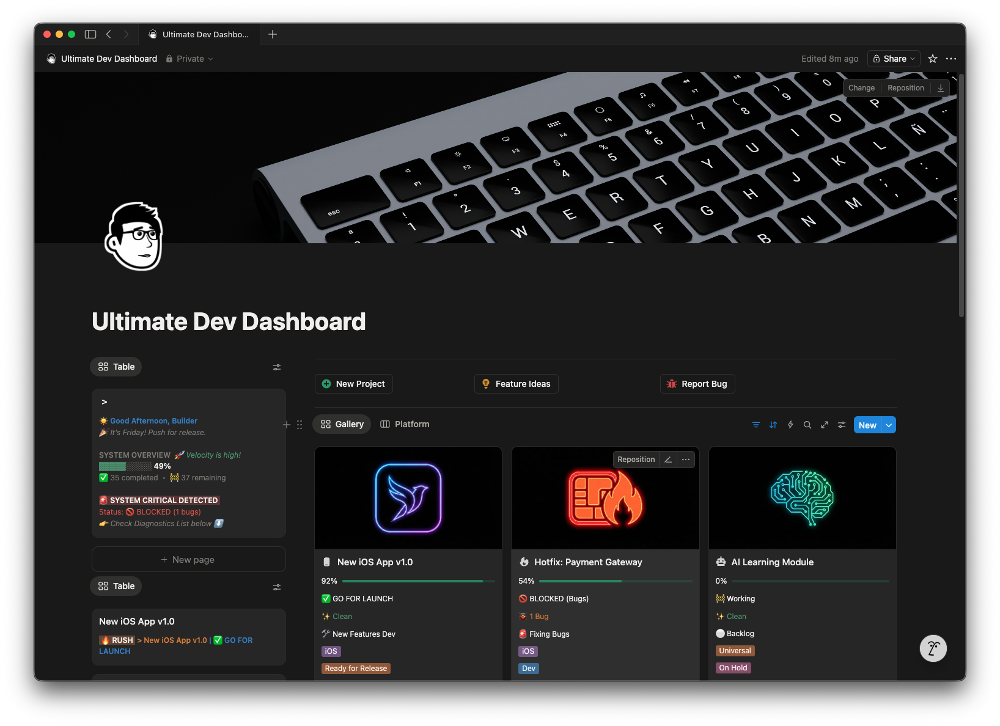
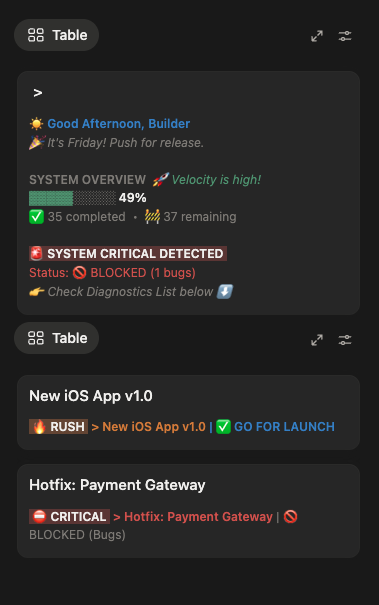
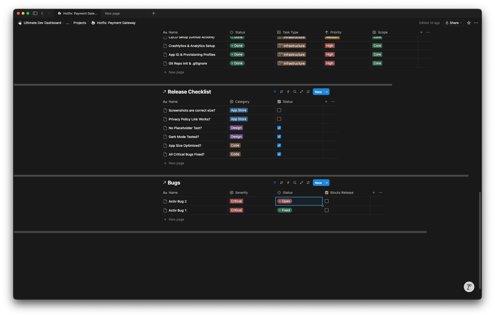
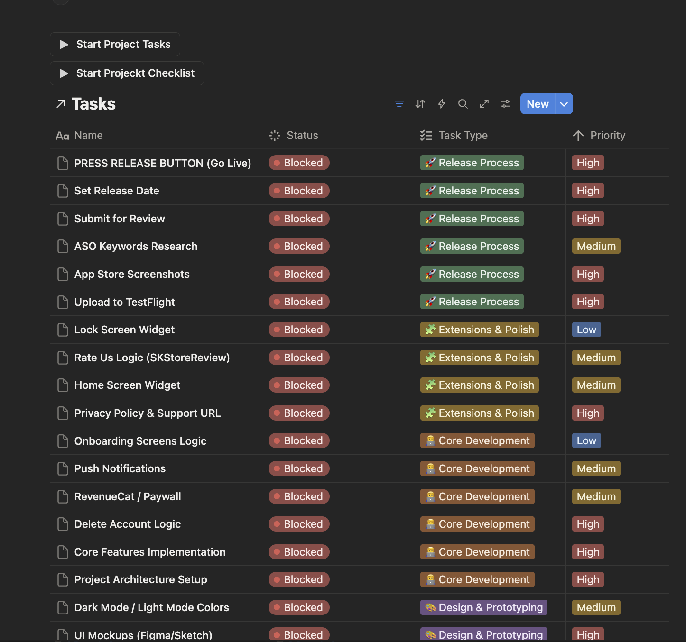
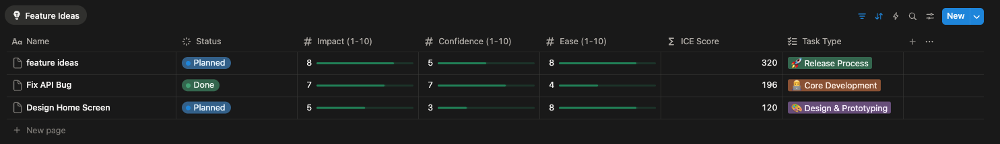
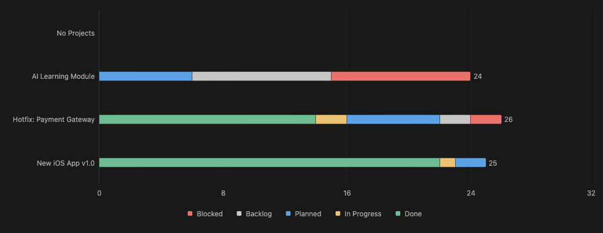

# 🚀 Ultimate Dev Dashboard
**The All-in-One Notion Operating System for Software Engineers & Indie Hackers**

 

  <i>Stop context-switching between Jira, Trello, and Google Docs. Bring your entire development workflow into one aesthetic, highly-functional workspace.</i>

---

## ⚡️ Why this dashboard?

As developers, we build complex systems, yet our own project management is often a mess of scattered tools. The **Ultimate Dev Dashboard** is engineered to solve this. It uses advanced Notion mechanics (Relational Databases, Rollups, Formulas) to create a dynamic environment that reacts to your workflow. 

### ✨ Core Capabilities:
* 🎛 **Dynamic Command Center:** Real-time velocity tracking and automated alerts when critical bugs block your release.
* 🚦 **Advanced ICE Prioritization:** Mathematically calculate which feature to build next.
* 🐛 **Integrated Bug Tracking:** Tie bugs directly to sprints and specific app versions.
* 🎨 **Glassmorphism / Neon Aesthetic:** Designed specifically for developers who live in Dark Mode.

---

## 🔍 System Architecture & Features

### 1. The Command Center
Get a bird's-eye view of your entire development ecosystem. 
* **Velocity Progress Bars:** Automatically calculates task completion percentages.
* **System Critical Alerts:** The dashboard dynamically warns you (`🚫 BLOCKED`) if there are unresolved critical bugs blocking a launch.

  

---

### 2. Deep Project Workspaces
Dive into individual projects (like *New iOS App v1.0* or *Hotfix: Payment Gateway*). Every project acts as its own mini-OS.
* **Release Checklists:** Ensure App Store / Play Store compliance before hitting publish.
* **Nested Bug Tracking:** Track open bugs and their severity without leaving the project page.

---

### 3. Granular Task Management & Sprints
Not just a to-do list. A highly structured Kanban and list architecture categorizing tasks by `Core Development`, `Release Process`, and `Extensions & Polish`.

---

### 4. Smart Feature Prioritization (ICE Score)
Don't guess what to build next. Use the built-in **ICE Scoring System** (Impact, Confidence, Ease). The dashboard automatically calculates the total score, telling you exactly which feature will bring the most value with the least effort.

---

### 5. Visual Sprint Timelines
Track your bandwidth and overlapping project schedules with the integrated timeline views, automatically colored by task status (Backlog, Planned, In Progress, Done).

---

## 🛒 How to Get It

This premium workspace architecture is available exclusively on Gumroad. 

👇 **Click the link below to duplicate the entire system into your Notion workspace:**

### [🚀 Download Ultimate Dev Dashboard on Gumroad](https://muhammadmnnm.gumroad.com/l/dev-dashboard)

---

## 🤝 Feedback & Support

I built this dashboard to solve my own problems as an indie developer, and I hope it supercharges your productivity too. 

If this template helps you ship your products faster, **please consider leaving a 5-star ⭐⭐⭐⭐⭐ rating on the [Gumroad product page](https://muhammadmnnm.gumroad.com/l/dev-dashboard).** It helps the algorithm and supports me in creating more tools for the developer community!

Got ideas for new features? Found a bug in the template? 
* Reach out to me via Gumroad messages.
* Or leave a review with your suggestions!

  <i>Happy coding and building! 🛠</i>

